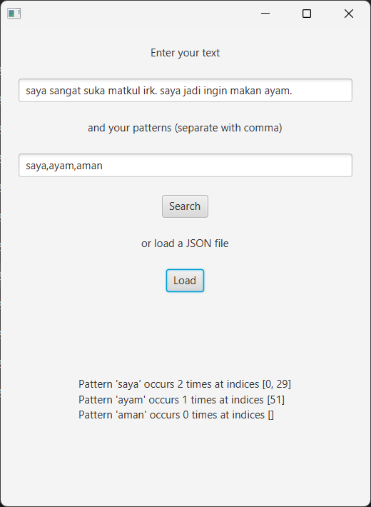
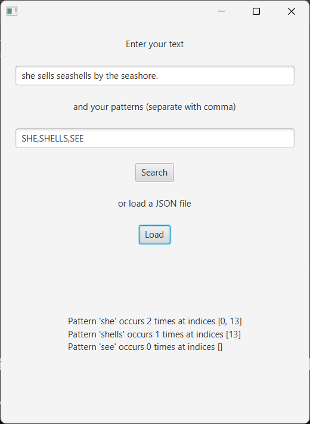
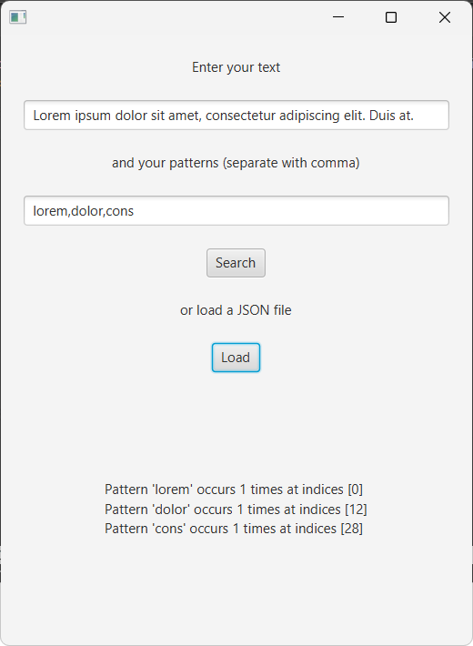

# Aho-Corasick Text Finder

## Daftar Isi

- [Deskripsi Aplikasi](#deskripsi-aplikasi)
- [Teknologi yang Digunakan](#teknologi-yang-digunakan)
- [Struktur Program](#struktur-program)
- [Penjelasan dan Penggunaan Algoritma](#penjelasan-dan-penggunaan-algoritma)
- [Cara Menjalankan Program](#cara-menjalankan-program)
- [Tangkapan Layar](#tangkapan-layar)
- [Referensi](#referensi)

## Deskripsi Aplikasi

Program ini adalah program _text finder_ sederhana dengan menggunakan algoritma Aho-Corasick.

## Teknologi yang Digunakan

- Java versi 22.0.1 atau lebih baru
- Maven
- JavaFX

## Struktur Program

```
.
├── ahocorasick-text-finder.jar
├── mvnw
├── mvnw.cmd
├── pom.xml
├── readme.md
├── src
│   └── main
│       ├── java
│       │   ├── com
│       │   │   └── ahocorasicktextfinder
│       │   │       ├── App.java
│       │   │       ├── AppWrapper.java
│       │   │       ├── Classes
│       │   │       │   ├── AhoCorasick.java
│       │   │       │   └── TextPattern.java
│       │   │       └── Controller
│       │   │           └── MainController.java
│       │   ├── META-INF
│       │   │   └── MANIFEST.MF
│       │   └── module-info.java
│       └── resources
│           ├── com
│           │   └── ahocorasicktextfinder
│           │       └── main.fxml
│           └── META-INF
│               └── MANIFEST.MF
└── target
    ├── classes
    │   ├── com
    │   │   └── ahocorasicktextfinder
    │   │       ├── App.class
    │   │       ├── AppWrapper.class
    │   │       ├── Classes
    │   │       │   ├── AhoCorasick$TrieNode.class
    │   │       │   ├── AhoCorasick.class
    │   │       │   └── TextPattern.class
    │   │       ├── Controller
    │   │       │   └── MainController.class
    │   │       └── main.fxml
    │   ├── META-INF
    │   │   └── MANIFEST.MF
    │   └── module-info.class
    ├── generated-sources
    │   └── annotations
    └── maven-status
        └── maven-compiler-plugin
            └── compile
                └── default-compile
                    └── inputFiles.lst
```

## Cara Menjalankan Program

1. Pastikan sudah menginstall [Java versi 22.0.1 atau yang lebih baru](https://www.oracle.com/java/technologies/downloads/).
2. Buka `ahocorasick-text-finder.jar`

## Tangkapan Layar




